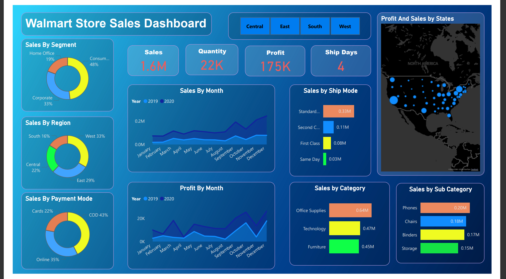
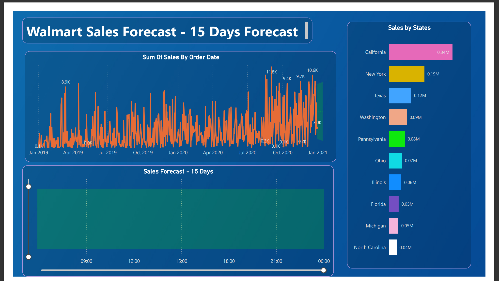

#  Walmart Sales Dashboard (Power BI)

##  Project Overview
This Power BI project analyzes Walmart sales data to uncover trends, profitability, and performance insights across regions, segments, and categories. 

It also includes a 15-day sales forecast to support business decision-making.

---

##  Key KPIs
-  Total Sales: 1.6M+
-  Total Quantity: 22K
-  Total Profit: 175K
-  Average Ship Days: 4

---

##  Key Insights
- West region contributes highest sales.
- Consumer segment dominates revenue.
- Technology category shows strong profitability.
- California and New York are top-performing states.
- 15-day forecast predicts stable growth trend.

---

##  Dashboard Features
- Sales by Region
- Sales by Segment
- Sales by Category & Sub-Category
- Sales by Payment Mode
- Monthly Profit Trends
- State-level Performance
- 15-Day Sales Forecast

---

##  Tools Used
- Power BI
- DAX
- Data Modeling
- Forecasting
- Data Visualization

---

##  Dashboard Preview

---

##  Business Value
This dashboard helps stakeholders:
- Monitor sales performance
- Identify high-performing regions
- Analyze profitability trends
- Forecast short-term revenue
